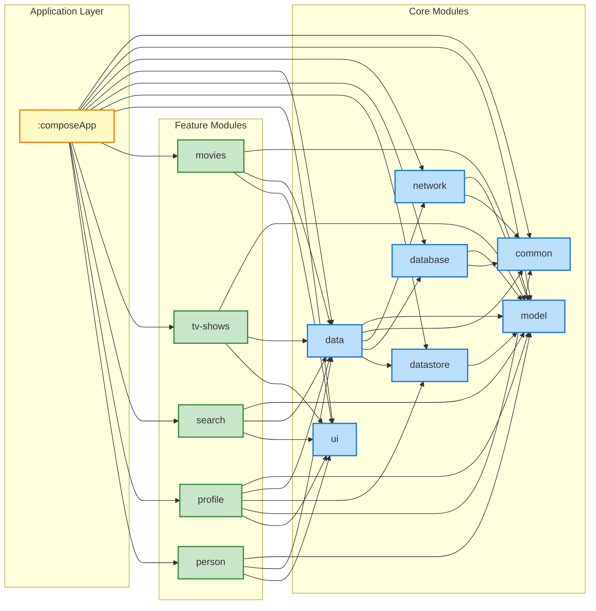

# Module Dependencies Graph

Last updated: 2025-12-29

This diagram shows the dependencies between modules in the CMP MovieDB project.

## Legend

- **App Layer** (Yellow): Main application module
- **Feature Modules** (Green): User-facing features with UI
- **Core Modules** (Blue): Shared infrastructure and business logic

## Module Descriptions

### Application Layer
- **composeApp**: Main application module with navigation and DI setup

### Feature Modules
- **movies**: Movies list and details screens
- **tv-shows**: TV shows list and details screens
- **search**: Multi-type search functionality
- **profile**: User profile and settings
- **person**: Cast/crew details screen

### Core Modules
- **data**: Repository implementations
- **ui**: Shared UI components and theme
- **network**: HTTP client and API definitions
- **database**: Room database for offline storage
- **datastore**: Preferences and state persistence
- **model**: Domain models and DTOs
- **common**: Common utilities and dispatchers
